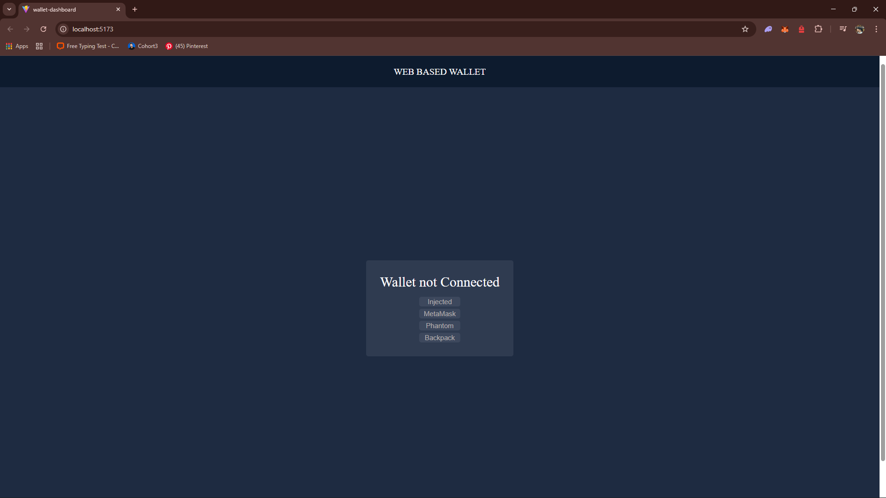
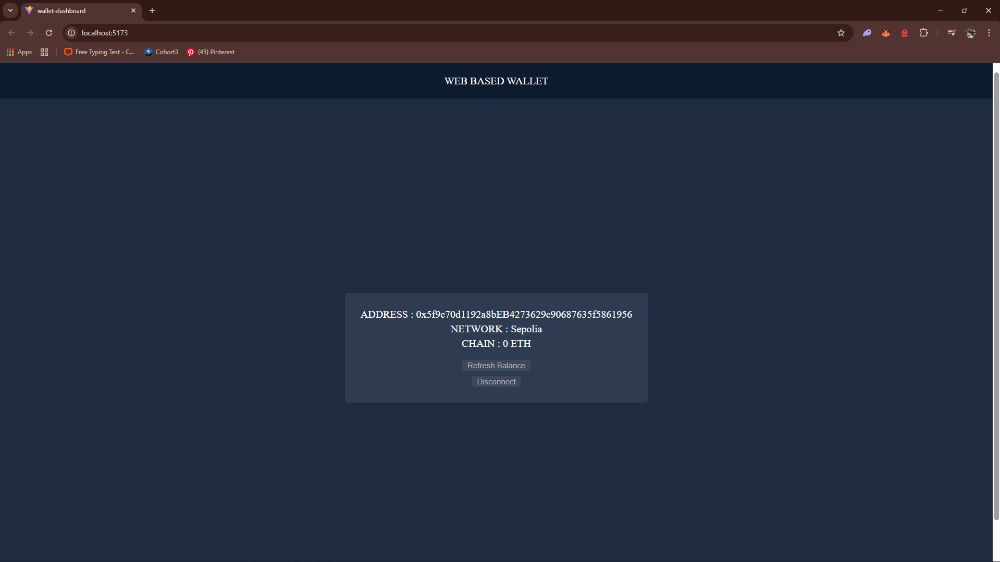

# 🚀 Web3 Wallet Dashboard

A Web3-enabled React application that allows users to connect Ethereum wallets and view real-time wallet information using Wagmi and Viem.

## ✨ Features

- Connect Ethereum wallets (MetaMask / Injected wallets)
- Display wallet address
- View wallet balance
- Supports Ethereum Mainnet and Sepolia Testnet
- Disconnect wallet functionality

## 🛠️ Tech Stack

- React
- Vite
- Wagmi
- Viem
- TanStack React Query

## 📸 Screenshots

### Wallet Not Connected

### Wallet Connected

## 🔗 Live Demo
https://react-web-3-wallet.vercel.app/

## ⚙️ Setup

git clone https://github.com/SalongDb/React-WEB3-wallet.git
cd web3-wallet-dashboard  
npm install  
npm run dev  

## 👨‍💻 Author

Salong Debbarma  
B.Tech CSE – NIT Agartala  
Aspiring Web3 Developer
